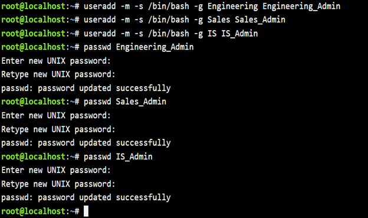
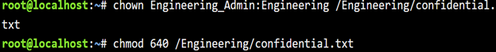

# User Management
# Directory and Group Creation
## Create Department Directories:

## Create Department Groups:

# User Creation
## Create Department Admins:

## Create Regular Department Users:

# Permissions Configuration
## Set Directory Ownership & File Access:

# Confidentiality Document
## Create Informational File & Protect the File:

# Deliverables

