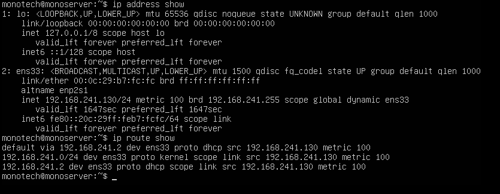
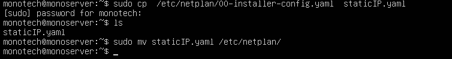
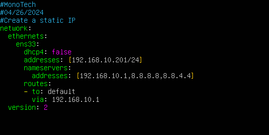
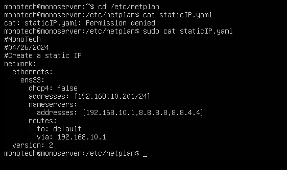
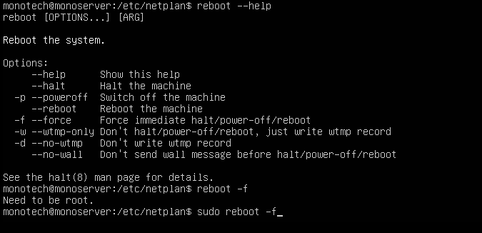
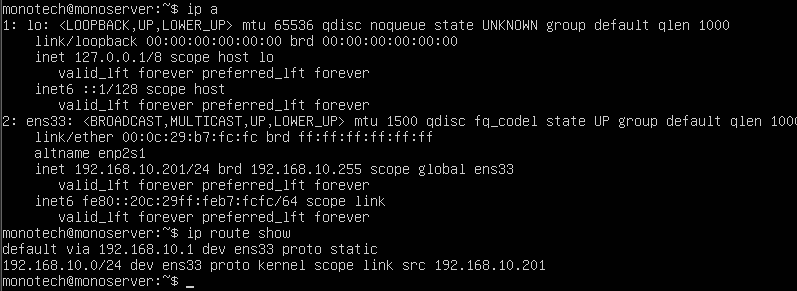
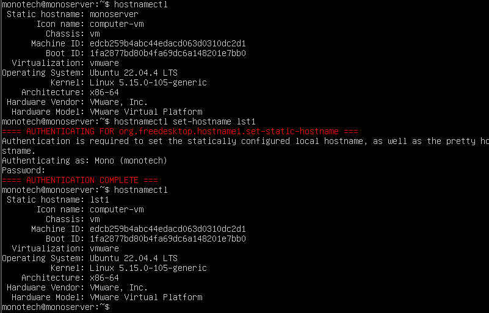

# Part 1. Change the VM’s IP address and hostname to lst1 

Submit a screenshot displaying the netplan yaml file and that the IP address was changed.

Submit a screenshot displaying the new hostname.

# Part 2. Install stress-ng

Submit a screenshot showing that stress-ng is installed.

# Part 3. Create a bob and alice account. Create an adminjr group.
Login as bob and attempt to change alice’s password. Submit a screenshot of bob’s failed attempt to change alice’s password.

Configure the adminjr group to change passwords. Add bob to the adminjr group. Submit a screenshot of bob changing alice’s passwd.

# Part 4.  Install SAR execute the cpubusy script and show CPU stress
Install sysstat. Verify installation download cpubusy.py using sar demonstrate that the CPU performance is degraded when executing the spubus.py script. Submit a screenshot of the CPU’s degraded performance

 # Part 5. Install cockpit
Submit a screenshot with the cockpit login screen.

# Part 6. Restrict access to SSH
Modify your server’s SSH configuration to allow  only the RemoteUsers group to use the SSH services. Add Bob to the RemoteUsers group. Submit a screenshot of Bob and Alice's attempt to SSH to the lst1 server.

-----------------------------------------------------
# Performance
# Part 1
# a. STATIC IP
## Note: At the beginning, I used NAT for network connection, but I had to change it into "Bridged" to directly connect my VM to my home network. This is important information because It caused a problem later. 
## Access the network
### ip address + ip route

### Make a copy of 00-installer-config.yaml. I named the copy staticIP.yaml

### Edit my ip config file

I changed dhcp4 from "true" to "false" because I will configure an IP for my VM

I added sections: addresses[ip]; nameserver/addresses[default gateway ip, google ip, google ip]; route/to[default] via[default gateway ip]

I checked the new file staticIP.yaml

### Apply the new configure + TROUBLESHOOTING 
Sadly, I had the problem. It was time to troubleshot it! Finally, I found that I had to switch from NAT to Bridge option for my VM's network connectivity.

 

After I switched the option, I rebooted my VM.

### Apply my netplan configuration

After the reboot, it automatically applied the rule! Let's check the ip address + ip route together!

So cool! It worked. Now, the IP changed as I set up!

# b. Change the hostname
## Check the old hostname before changing to the new hostname + Change the old one into "lst1"

